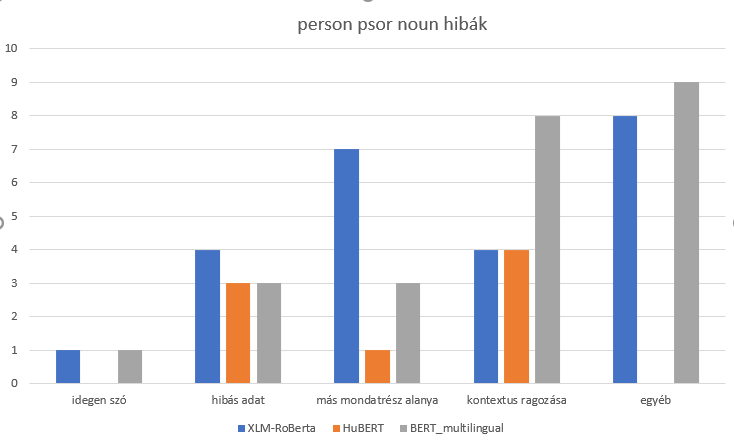
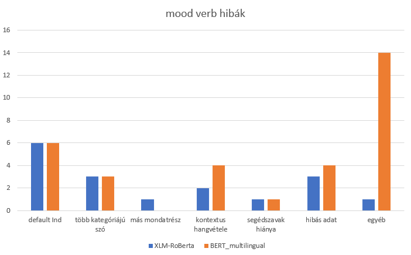

# Thesis work

## The reason

* This repository is containing files that were used to work on the project of measuring different BERT models by probing, in order to find differences, and decide which model is the better than the other, and why. The thesis was written in hungarian so some files have hungarian names

## The Jupyter notebooks and the sln file's connection

* I used a remote LINUX computer for some of my works, and since i used jupyter notebooks and some importable libraries, i needed something to import them with. This was Miniconda, that is contained in the sln file.
* For better understanding i used jupyter notebooks first to create the python files, that helped me to analyse the BERT models. I wanted to deep dive into pandas, to use it for the program, so i tried the DataFrames' functions out, by a jupyter notebook of my consultant. 
* Then for preparation, i created a jupyter notebook to measure 2 BERT models' tokenizers and their results manually, so i could see how they work. 
* I used then the hidden layers of the BERT models for probing, so i had to find out how can i extract the given tensors from it. I created another notebook for that purpose. 
* When i knew everything i needed, i created the program, that did the actual probing and showed the results of the training.
* After i created the real probing program in python, and extracted results into python files, then put together into csv files, i used another jupyter notebook file to plot the results for the thesis work, and for myself to see a bigger picture.

## The python files

* The model_test_1.py was the program created in jupyter notebook, that i used to run the same probing, but now saving the results into result files.
* The model_configurable.py is the program that i used to get the final results into result files. It is configurable by hydra, and usable to test any BERT model of the 3 on any data group out of the 11 by any hidden layer of the BERT out of the 13. 

## The conf directory

* This directory is for configuring the program, that was used for measuring the BERT models.
* It contains yaml files for each configuration option, by the hydra standard.
* The subfolders in the data folder contain the actual data files sorted by data group.
* Each data group consists of a train.tsv, a dev.tsv and a test.tsv that contain the data itself in a given structure.

## The scripts

* There are two script files now, script_try and script_try_first_half, these are looking for a model as a parameter, and they will iterate through all data groups and all layers, and save the results into the given folders for more evaluating. They are made very simply, one iterates through the first 7 layers, the other uses the last 6.

## The resultss directory

* This directory contains the results of each BERT model.
* In every BERT model's folder, there are the predicted files for a few data groups. Those were used for categorization of the faults of each BERT model.
* In every BERT model's folder the results with dev and test accuracies are sorted, by the used hidden layer of the BERT, into subfolders.
* The layer subfolders contain a file with every data groups' results in them, with dev and test accuracies.

## The csv and pptm files

* These files were used to get a bigger picture of the collected datas. They were created by collecting out every test accuracy from the result files in every subfolder of the results folder.
* The ones that have latex in their names were used in the thesis itself, as tables.
* In the pptm file i created figures for the thesis, to represent some parts of it.

## The PNG files and the pdf file

* The PNG files were used for the thesis to make it more readable and easier to imagine some parts in it. The pdf contained the graphs created by the plotting jupyter notebook, and the graph PNGs used this file as source.
* Some PNG files used the pptm file for source, others used outer sources, mentioned in the thesis.

## The fail categorizing

* I categorized the failures of all 3 BERT models on person_psor_noun data group, and categorized failures of XLM-RoBERTa and BERT multilingual on mood_verb data group. The statistics of the categorizing:

person_psor_noun fail types | XLM-RoBERTa | HuBERT | BERT multilingual
---------- | ---------- | ---------- | ----------
foreign word | 1 | 0 | 1
false data | 4 | 3 | 3
another piece of the sentence is another type | 7 | 1 | 3
close context is another type | 4 | 4 | 8
other | 8 | 0 | 9

mood_verb fail types | XLM-RoBERTa | BERT multilingual
---------- | ---------- | ----------
default In choosing | 6 | 6
a word can be more types at once | 3 | 3
other piece of sentence is another type | 1 | 0
close context's mood | 2 | 4
lack of helpiful words in context | 1 | 1
false data | 3 | 4
other | 1 | 14

* I created charts of these results, that were used in the thesis too

## Failure examples for some categories

* From person_psor_noun:

failure type | guessed type | type | word | sentence
---------- | ---------- | ---------- | ---------- | ----------
false data | 2 | 1 | munkát | Tovabbi jó foldmunkat !
close context is another type | 2 | 1 | referenciaanyagunkba | A www.giveinformbt.hu honlapunkon betekintést nyerhet referenciaanyagunkba .
another piece of the sentence is another type | 2 | 1 | társadalmunknak | Az öntudat már motoszkál benned , de remélhetőleg idővel egy kicsit megnyugszol és hasznos tagja leszel kis magyar társadalmunknak .

* From mood_verb:

failure type | guessed type | type | word | sentence
---------- | ---------- | ---------- | ---------- | ----------
default Ind | Ind | Pot | rajzolhatunk | Egy közkedvelt őszi DIY párnahuzat ötlet , melyet a gyerekekkel közösen is rajzolhatunk .
false data | Ind | Imp | köszönöm/köszönjük | A segítségeteket előre is nagyon köszönöm/köszönjük !
context is another mood | Pot | Imp | hazamehetett. | Még sokminden vár rá , de ma legalább hazamehetett. :)
a word can be more than one type | Ind | Imp | újragondolják | A szociális ügyek megoldásának felelősségét a lakosság tradicionálisan a kormányok , egyház , illetve a családok ügyének tekintette , azonban a gazdasági válság sokakat arra kényszerített , hogy újragondolják ezt a nézetet .
